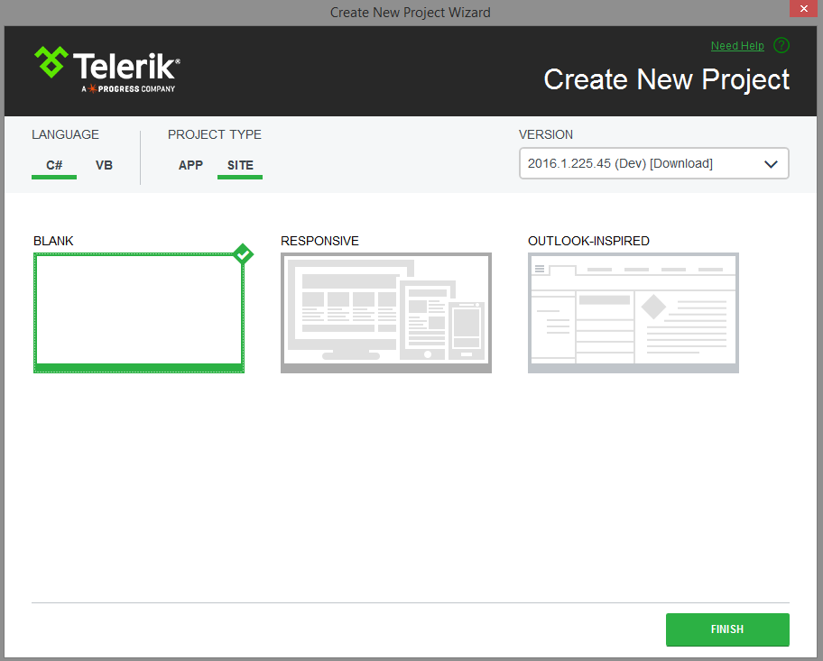

# Create Project

The Project management functionality of the Visual Studio Extensions handles project assembly reference updates, web.config entry management and updates of the supporting resources.

This functionality is handled by two wizards - the Project Configuration Wizard and the [Upgrade Wizard]().

The Project Configuration Wizard is called when:

* Creating a new Telerik WebSite/WebApplication (through the Visual Studio New Project dialog).

* Converting a web project to a Telerik one (accessed through the Telerik > Telerik UI for ASP.NET AJAX menu).

* Configuring a Telerik web project (accessed through the Telerik > Telerik UI for ASP.NET AJAX menu).

The Project Configuration Wizard’s first page lets you define settings related to Telerik controls:

* **Telerik Assemblies** - Select the Telerik controls distribution to be used. You can choose from the detected assemblies (from an installation folder), or you can browse to an assemblies located somewhere on your hard drive (e.g. when you've downloaded a zip file from the [Latest Internal Builds](http://www.telerik.com/blogs/download-latest-internal-builds) page).

* **Project type** – Select the Telerik project type (the option is only available in the **New Project Wizard**). The Empty site only references the assemblies and has the [mandatory additions to the web.config](#mandatory-additions-to-the-webconfig). The *Responsive Web Site* is a template that uses the [RadPageLayout]() control to provide a basic template for a responsive web page.

* **Skin packs** - Choose the skin packs to be added to the project. Check the content of each skin pack (a skin pack is an assembly that contains one or more skins) and select the one(s) you want to be included in the project. If you want to add or remove a skin pack later, you can use the Configure Project wizard.

* **Default skin** - Select a global site-wide skin to be used by Telerik UI for ASP.NET AJAX. This can be overridden by using the [Skin]() property of each single control afterwards.

* **Add referenced assemblies to solution** -	Choose whether to copy referenced assemblies to your solution folder. The assemblies will automatically get added to source control when using Microsoft Team Foundation Server.

>note The **Add referenced assemblies to solution** option is not available for Visual Studio web site projects.

>note When creating a new project, the [Render Mode]() of the Telerik controls is automatically set to **Lightweight**.

On the third page the wizard suggests Document Processing assemblies to be included in your project.

On the second page the wizard suggests more site settings and several resource options:

* **Use ScriptManger CDN** - Define if the site will utilize [RadScriptManager CDN Support]().

* **Use StyleSheetManager CDN** - Define if the site will utilize [RadStyleSheetManager CDN Support]().

* **Copy RadSpell Dictionaries** - Select whether you wish the project wizard to copy the dictionary files required for [RadSpell]() to your project.

* **Copy RadCaptcha Audio Files** - Select whether you wish the project wizard to copy the audio files required for [RadCaptcha]() audio code functionality.

* **Copy TypeScript definitions** – Select whether you with the project wizard to copy the	[TypeScript definitions we provide for the UI for ASP.NET AJAX controls]().

* **General Web Project settings** - [RadUpload]()-related configuration - the [Maximum Request Length and Execution Timeout]() settings of the site.

* **Use jQuery Support** - Define if the pages that will be created via the Scenario Wizard will use jQuery support by default.

* **Use Ajaxified Templates** - Define if the pages that will be created via the Scenario Wizard will use [RadAjaxManager]() by default.

>note The Project Configuration wizard does not allow the targeted Telerik controls distribution to be changed when configuring a project. In that mode you can change the other project properties though. Changing the Telerik UI for ASP.NET AJAX distribution of a project is handled by the [Upgrade Wizard]().
>

When a web project gets reconfigured, Visual Studio Extensions perform the following changes:

* Telerik assembly references get added or are changed in the project.

* [The user gets notified]() through the Project Configuration wizard if the wizard cannot find a correct Telerik.Web.Design assembly in the GAC.

* The wizard copies the RadSpell dictionaries and RadCaptcha audio files shipped with the distribution so that they are up to date with the assemblies.

The web.config file gets updated as per the choices in the wizard:

* The global skin registration is updated.

* A registration for the "telerik" tag prefix is added, so that it is not needed to have the `<%@ Register %>` directive in each page.

* RadScriptManager and RadStyleSheetManager default CDN settings are persisted.
